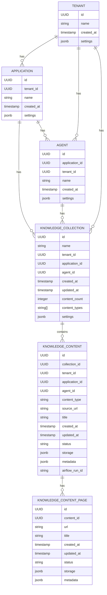

# Firecrawl Data Model

## PostgreSQL Database Schema

The Firecrawl system leverages an existing PostgreSQL database that contains tenant, application, and agent data. This document outlines the extended schema to support knowledge collections and content storage.

### Existing Tables (Assumed Structure)

```sql
-- Tenants Table
CREATE TABLE tenants (
    id UUID PRIMARY KEY,
    name VARCHAR(255) NOT NULL,
    created_at TIMESTAMP WITH TIME ZONE DEFAULT NOW(),
    settings JSONB DEFAULT '{}'
);

-- Applications Table
CREATE TABLE applications (
    id UUID PRIMARY KEY,
    tenant_id UUID NOT NULL REFERENCES tenants(id) ON DELETE CASCADE,
    name VARCHAR(255) NOT NULL,
    created_at TIMESTAMP WITH TIME ZONE DEFAULT NOW(),
    settings JSONB DEFAULT '{}'
);

-- Agents Table
CREATE TABLE agents (
    id UUID PRIMARY KEY,
    application_id UUID NOT NULL REFERENCES applications(id) ON DELETE CASCADE,
    tenant_id UUID NOT NULL REFERENCES tenants(id) ON DELETE CASCADE,
    name VARCHAR(255) NOT NULL,
    created_at TIMESTAMP WITH TIME ZONE DEFAULT NOW(),
    settings JSONB DEFAULT '{}'
);
```

### New Tables for Knowledge Management

```sql
-- Knowledge Collections Table
CREATE TABLE knowledge_collections (
    id UUID PRIMARY KEY,
    name VARCHAR(255) NOT NULL,
    tenant_id UUID NOT NULL REFERENCES tenants(id) ON DELETE CASCADE,
    application_id UUID NOT NULL REFERENCES applications(id) ON DELETE CASCADE,
    agent_id UUID REFERENCES agents(id) ON DELETE SET NULL, -- Optional in future structure
    created_at TIMESTAMP WITH TIME ZONE DEFAULT NOW(),
    updated_at TIMESTAMP WITH TIME ZONE DEFAULT NOW(),
    content_count INTEGER DEFAULT 0,
    content_types TEXT[] DEFAULT '{}',
    settings JSONB DEFAULT '{}',
    CONSTRAINT unique_collection_name_per_context UNIQUE (tenant_id, application_id, agent_id, name)
);

-- Knowledge Content Table
CREATE TABLE knowledge_content (
    id UUID PRIMARY KEY,
    collection_id UUID NOT NULL REFERENCES knowledge_collections(id) ON DELETE CASCADE,
    tenant_id UUID NOT NULL REFERENCES tenants(id) ON DELETE CASCADE,
    application_id UUID NOT NULL REFERENCES applications(id) ON DELETE CASCADE,
    agent_id UUID REFERENCES agents(id) ON DELETE SET NULL,
    content_type VARCHAR(50) NOT NULL CHECK (content_type IN ('webpage', 'pdf', 'text', 'crawl')),
    source_url TEXT,
    title VARCHAR(255) NOT NULL,
    created_at TIMESTAMP WITH TIME ZONE DEFAULT NOW(),
    updated_at TIMESTAMP WITH TIME ZONE DEFAULT NOW(),
    status VARCHAR(50) NOT NULL DEFAULT 'pending' CHECK (status IN ('pending', 'processing', 'completed', 'failed')),
    storage JSONB NOT NULL DEFAULT '{}',
    metadata JSONB NOT NULL DEFAULT '{}',
    airflow_run_id VARCHAR(255)
);

-- Create indexes for performance
CREATE INDEX idx_knowledge_content_collection_id ON knowledge_content(collection_id);
CREATE INDEX idx_knowledge_content_tenant_app ON knowledge_content(tenant_id, application_id);
CREATE INDEX idx_knowledge_content_status ON knowledge_content(status);
CREATE INDEX idx_knowledge_content_content_type ON knowledge_content(content_type);

-- Knowledge Content Pages (for crawls with multiple pages)
CREATE TABLE knowledge_content_pages (
    id UUID PRIMARY KEY,
    content_id UUID NOT NULL REFERENCES knowledge_content(id) ON DELETE CASCADE,
    url TEXT NOT NULL,
    title VARCHAR(255),
    created_at TIMESTAMP WITH TIME ZONE DEFAULT NOW(),
    updated_at TIMESTAMP WITH TIME ZONE DEFAULT NOW(),
    status VARCHAR(50) NOT NULL DEFAULT 'pending',
    storage JSONB NOT NULL DEFAULT '{}',
    metadata JSONB NOT NULL DEFAULT '{}'
);

-- Create index for content pages
CREATE INDEX idx_knowledge_content_pages_content_id ON knowledge_content_pages(content_id);
```

## JSON Structure Examples

### Knowledge Collection Settings

```json
{
  "refresh_frequency": "daily", 
  "processing_options": {
    "extract_links": true,
    "include_images": false,
    "max_depth": 3,
    "follow_external_links": false,
    "extract_metadata": true
  },
  "notification": {
    "enabled": true,
    "email": "user@example.com",
    "on_completion": true,
    "on_failure": true
  }
}
```

### Content Storage JSON

```json
{
  "bucket": "firecrawl-content",
  "raw_path": "tenant_123/application_456/agent_789/collection_abc/raw/content_xyz.html",
  "processed_path": "tenant_123/application_456/agent_789/collection_abc/processed/content_xyz.md",
  "metadata_path": "tenant_123/application_456/agent_789/collection_abc/metadata/content_xyz.json"
}
```

### Content Metadata JSON

```json
{
  "title": "Example Page Title",
  "description": "Meta description from the page",
  "url": "https://example.com/page",
  "processed_at": "2025-03-14T19:00:00Z",
  "word_count": 1250,
  "content_type": "webpage",
  "language": "en",
  "links": [
    "https://example.com/related-page-1",
    "https://example.com/related-page-2"
  ],
  "images": [
    {
      "url": "https://example.com/image1.jpg",
      "alt": "Image description"
    }
  ],
  "headers": [
    {
      "level": 1,
      "text": "Main Header"
    },
    {
      "level": 2,
      "text": "Subheading"
    }
  ]
}
```

## Google Cloud Storage Structure

```
gs://firecrawl-content/
├── tenant_<tenant_id>/
│   ├── application_<app_id>/
│   │   ├── agent_<agent_id>/  # Optional in future structure
│   │   │   ├── collection_<collection_id>/
│   │   │   │   ├── raw/
│   │   │   │   │   ├── <content_id>.<extension>
│   │   │   │   │   └── ...
│   │   │   │   ├── processed/
│   │   │   │   │   ├── <content_id>.json
│   │   │   │   │   ├── <content_id>.md
│   │   │   │   │   └── ...
│   │   │   │   └── metadata/
│   │   │   │       └── <content_id>.json
│   │   │   └── ...
│   │   └── collection_<collection_id>/  # For future structure without agent
│   │       ├── raw/
│   │       ├── processed/
│   │       └── metadata/
│   └── ...
└── shared/
    └── <shared_resources>
```

## Entity Relationships


